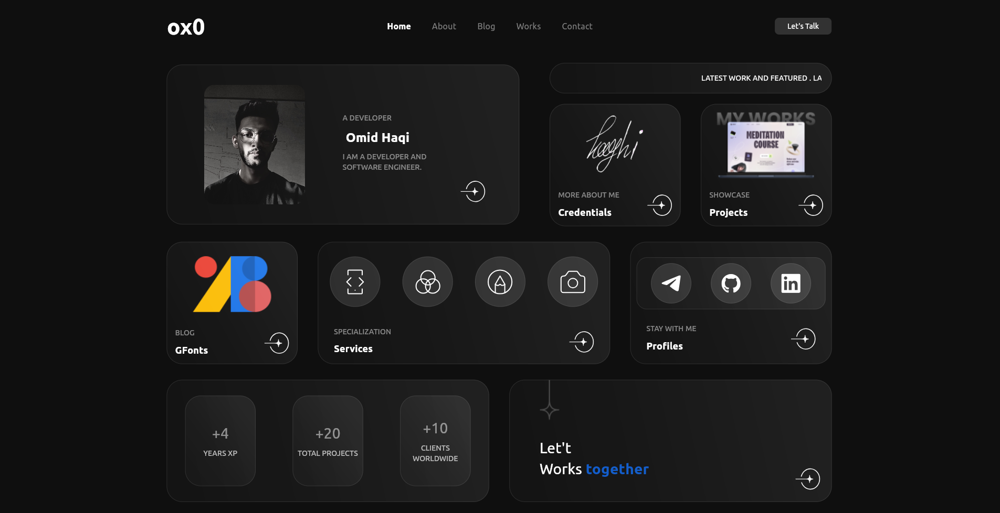

# Personal Portfolio Website

A modern, responsive personal portfolio website built with Flutter Web. Features a clean design showcasing professional experience, projects, and blog posts.

## Features

- **Responsive Design**: Optimized layouts for desktop, tablet and mobile devices
- **Modern UI Components**:
  - Animated text transitions 
  - Custom cards for projects and credentials
  - Social media section
  - Service showcases
  - Statistics display
  - Blog post viewer with HTML support
- **Dark Theme**: Sleek dark mode interface
- **Dynamic Content**: Content managed through PocketBase backend
- **Multi-page Navigation**: Home, About, Works, Blog, and Contact pages with clean URL paths

## Screenshot



## Tech Stack

- Flutter 3.27.0+
- Bloc for state management
- GetIt for dependency injection
- PocketBase for backend services
- SharedPreferences for local storage
- SVG and animation support
- HTML rendering capabilities

## Getting Started

### Prerequisites

- Flutter SDK 3.27.0 or higher
- Dart SDK ^3.5.3

### Installation

```bash
# Clone the repository
git clone https://github.com/omidhaqi/omidhaqi.github.io.git

# Navigate to project directory
cd omidhaqi.github.io

# Install dependencies
flutter pub get

# Run the app
flutter run -d chrome
```

### Development

```bash
# Enable web support
flutter config --enable-web

# Build for web
flutter build web --release
```


## Route Management

The application uses custom route management for web navigation with clean URLs using `urlPathStrategy`.

### Enabling URL Path Strategy

In `main.dart`, the `usePathUrlStrategy()` function is called to enable clean URLs without hash fragments:

```dart
void main() {
  // ...existing code...

  usePathUrlStrategy();

  runApp(MyApp());
}
```

### Custom Routes

Routes are defined in `lib/routes.dart` using `onGenerateRoute`:

```dart
Route<dynamic>? onGenerateRoute(RouteSettings settings, BuildContext context) {
  // ...existing code...
}
```

This setup allows for dynamic route handling and smooth page transitions across the web app.

## Deployment

The project uses GitHub Actions for automated deployment to GitHub Pages. Any push to the `develop` branch triggers the build and deployment workflow.

## License

Distributed under the Apache License 2.0. See [`LICENSE`](LICENSE) for more information.

## Contact

Omid Haqi - [Email](mailto:omid.haqi@outlook.com)

Project Link: [https://github.com/omidhaqi/omidhaqi.github.io](https://github.com/omidhaqi/omidhaqi.github.io)